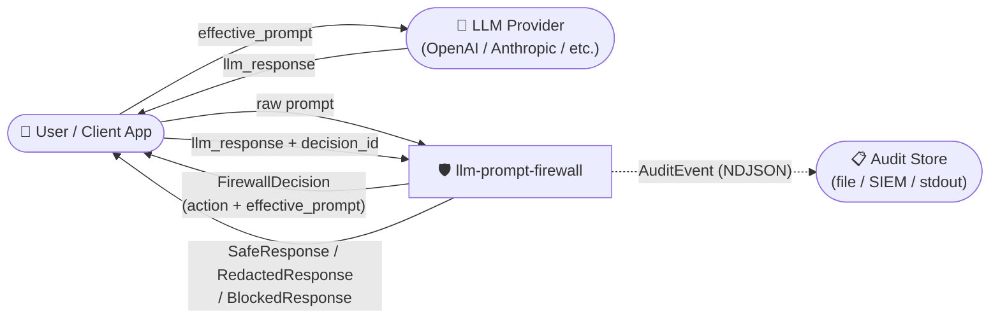
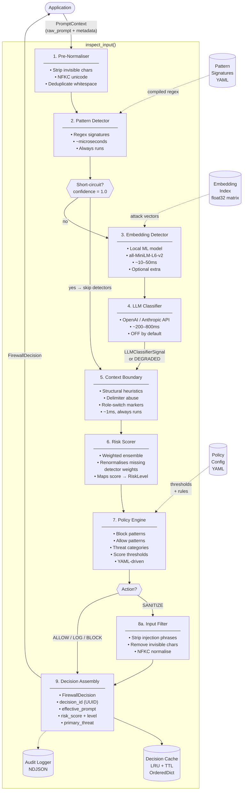
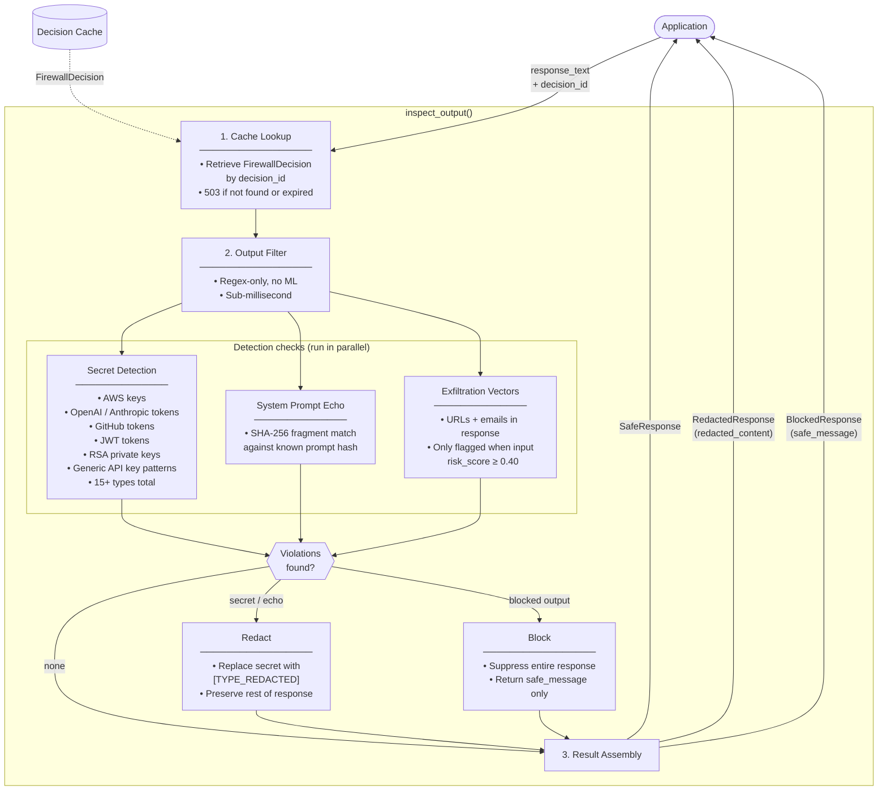
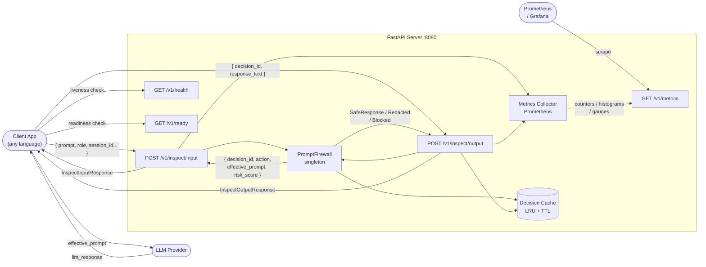

# ADR-002: Data Flow Diagram

**Date:** 2026-03-15
**Status:** Accepted

---

## Level 0 — Context Diagram

Shows the system boundary and what flows in and out.

---

## Level 1 — Input Inspection Pipeline

What happens inside `firewall.inspect_input()`.

---

## Level 1 — Output Inspection Pipeline

What happens inside `firewall.inspect_output()`.

---

## Level 1 — REST API Data Flow

How data moves when using the HTTP server instead of the library directly.

---

## Data Stores Reference

| Store | Type | Contents | Lifecycle |
|---|---|---|---|
| Pattern Signatures | YAML (bundled) | Regex patterns + threat categories | Loaded once at startup |
| Embedding Index | In-memory float32 matrix | Normalised attack vectors | Built once at startup from dataset |
| Policy Config | YAML (file or default) | Thresholds, block/allow rules | Loaded at startup, hot-reload supported |
| Decision Cache | In-memory OrderedDict | `decision_id → (FirewallDecision, timestamp)` | LRU eviction + TTL expiry (default 5 min, max 10k entries) |
| Audit Log | NDJSON file or stdout | AuditEvent per inspection | Append-only, configurable via `FIREWALL_AUDIT_LOG_FILE` |

---

## Key Data Flows Summary

| Flow | From | To | Notes |
|---|---|---|---|
| `PromptContext` | Application | `inspect_input()` | Carries raw prompt + session metadata |
| `FirewallDecision` | `inspect_input()` | Application + Cache | Immutable; `decision_id` links it to output |
| `effective_prompt` | Application | LLM Provider | From `decision.effective_prompt` — may be sanitized |
| `response_text + decision_id` | Application | `inspect_output()` | App passes both together |
| `SafeResponse / RedactedResponse / BlockedResponse` | `inspect_output()` | Application | Final result to return to user |
| `AuditEvent` | Firewall | Audit Store | No raw prompts — SHA-256 hashes only |
| Prometheus scrape | Prometheus | `/v1/metrics` | Pull-based, every 15s by default |
